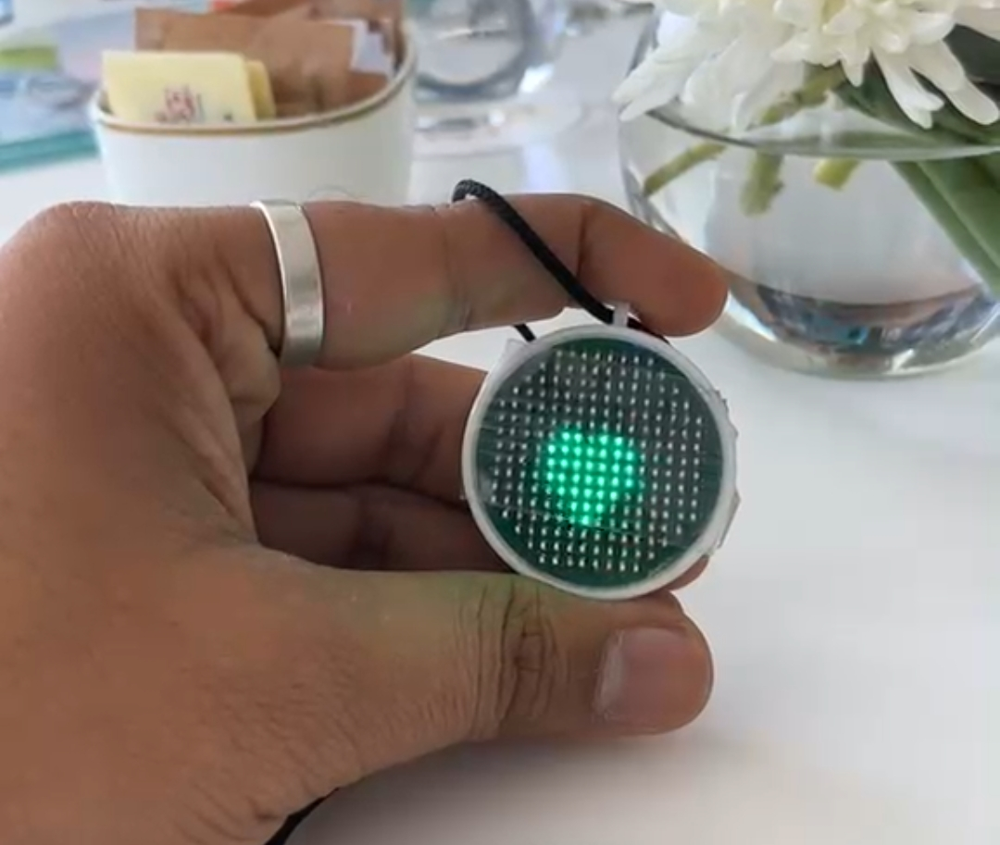

# Building Nia - Discovering the powers of RP2354

## Hey there Wanderer
This blog was supposed to be a year earlier but here we are. I just finsihed the development of the first prototype (not really the first lol) for the Nia pendant. I demo'ed it at the Open Source Summit India this week in Mumbai. Honestly building a badge from scratch and interacting with people interested in it was something special. We need more of these badge hacking and building enthusiasts in these conferences (especially in India).

Keeping the rant aside lets get into the hacking 🤘.

## The inspiration
An year ago I saw this video by mitxela showcasing his fluid sim pendant. It caught my attetion and I wanted to making something like that of my own. I started with the physics first. Getting a hold of whats moving and whats not in a simulation was really important.

I then researched I hardware I wante to work with. STM is great but I have a soft edge for Raspberry. This edge led me to choosing RP2354A for this project. We'll discover later why. This uses Bma400 accelerometer, TPS3839A09DQNR, TPS7A0215PDQNR and MCP73832-2-MC for charging the rechargable cell.

Now that we have the basic hardware used listed, lets checkout some physics resources that helped me in my research. 10 Minutes Physics was a great help. His videos on Euler fluid simulation and FLIP simulations are self explanatory and quite sufficient. While these were enough I took some time to also look at the Flui Simulation by Robert Bridson.

I suggest going through his tutorials and the JavaScript code he has written once while trying your shot at it. He's done a great job with both the tutorials and the code.

## Getting started with the PCB
This first thing I did was get started with the schematic. I needed to figure out how to get this charliplexing done and create a prototype so that I am sure that it actually works.

I ordered some LEDs and started soldering them. The initial assembly wasn't a problem. But before actually soldering the LEDs to the board I made a schematic. THIS WAS A VERY IMPORTANT STEP.

I wired up a 10x9 version of the matrix for the prototype. This started with building a schematic for the same.

